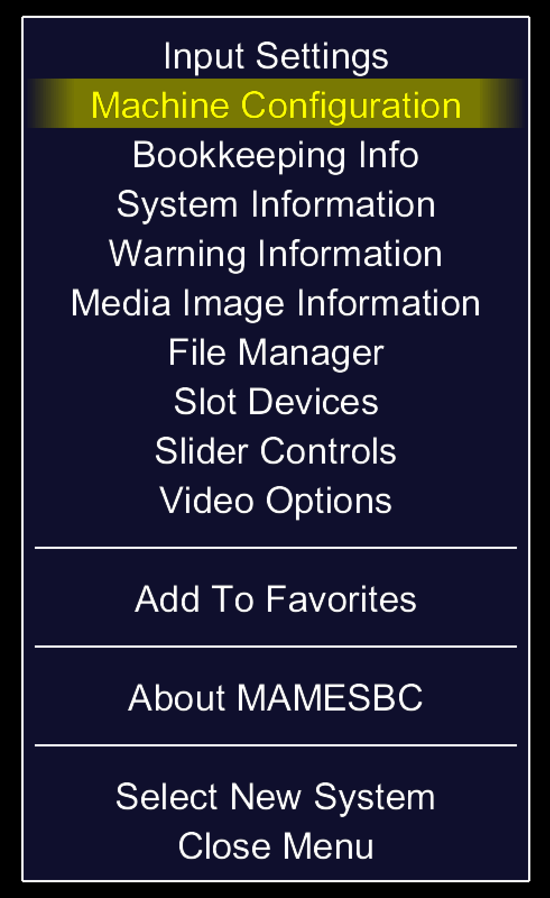
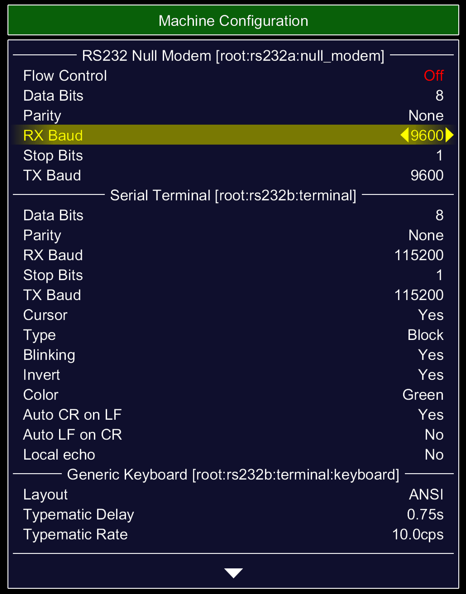
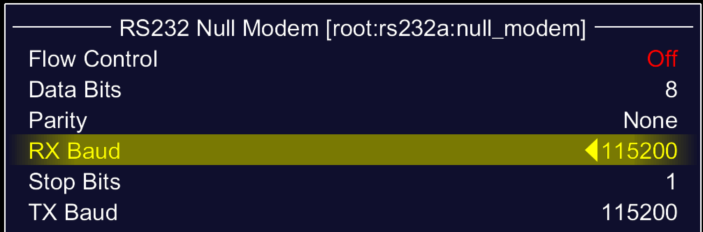

## Using MAME with a virtual serial port

You can use MAME with a virtual serial port, instead of sending serial output to the emulated
screen, which works but does have some limitations (lack of ANSI support being one).

Firstly you need to set the speed of the null_modem device to 115200, since it defaults to 9600. 

You probably can do that in the ini, but I've found it's easier to go into the MAME menus and set 
it up there. If you run:

```shell
./sbc rosco_classicv2 -window -rs232a null_modem -bitb socket.localhost:1234
```

You should be taken into the MAME UI, where you will need to open up the machine settings page. 

On my machine (macOS) that means I have to hit the <kbd>⌦</kbd> (delete right) key to enable UI
controls, and then hit <kbd>⇥</kbd> (tab). 

That brings up this:



From there, going into machine configuration takes you to this:



You should change the baud rates under the "Null Modem" section to look like this:



Once that's changed you can exit completely, since you'll likely prefer to start actual programs
under the debugger, you should be able to select "Return to previous menu" a few times, or maybe 
hit escape, to get out.

Now, to run some actual software, run this command:

```shell
./sbc rosco_classicv2 -rs232a null_modem -bitb socket.localhost:1234 -debug -quik /path/to/some/program.bin
```

This should start up with the debugger, and it'll start up suspended, giving you time to connect
your terminal to plain TCP, localhost, port 1234. Once connected, you can get the standard screen
out of the way (it won't do anything in this setup and hit g in the MAME debugger and you should 
be off to the races.

### GDB Debugging

It’s probably worth noting that you can do the same thing with the second UART port by passing
`-rs232b` and setting a socket up, which you can then connect to with GDB (using an appropriate
`target remote` command) if you’re using the GDB support in the standard library 🙂.

