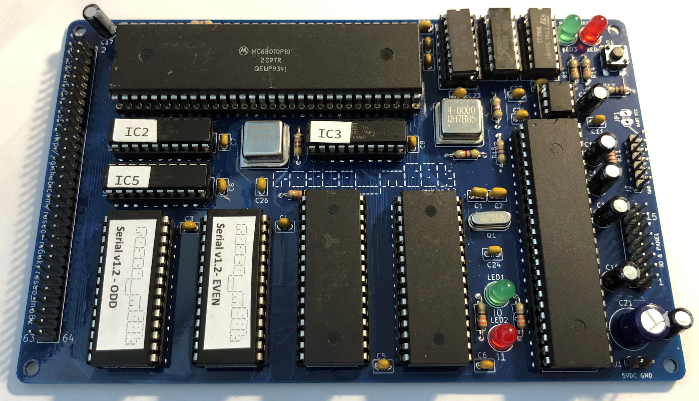

# Really Old-School Computer - M68K
## A Motorola 68k Single-Board Computer

> **Note**: This is the Master branch, which contains the latest release - **Revision 1.23** and **Firmware 1.3**. If you are using Firmware 1.3, this is the branch you should be using to build the standard libraries and example programs. If you are on a 1.2 board with Firmware 1.2, please use the [1.2 release branch](https://github.com/rosco-m68k/rosco_m68k/tree/release/revision-1.2). If you have a revision 1 board, please use the [1.1 release branch](https://github.com/rosco-m68k/rosco_m68k/tree/release/revision-1.1) (or the [1.01 release branch if you have firmware 1.01](https://github.com/rosco-m68k/rosco_m68k/tree/release/revision-1.01)).

This repository holds design files, firmware and software for the Really Old-School Computer 
(M68k) single-board computer, AKA the rosco_m68k. This is a fully-featured, programmable,
extensible and capable 16/32-bit retro computer that is completely open source and is
available in kit form (Starting April 2020).

This project contains all the design files and source code for the project. For 
documentation (including assembly instructions) please see https://rosco-m68k.com

You can find the project along with some logs about its development history
on Hackaday: https://hackaday.io/project/164305-yet-another-m68k-homebrew

* All Software released under the MIT licence. See LICENSE for details.
* All Hardware released under the CERN Open Hardware licence.See LICENCE.hardware.txt.
* All Documentation released under Creative Commons Attribution. See https://creativecommons.org/licenses/by/2.0/uk/
* OSHWA-certified Open Source Hardware

## Specifications

### Hardware

The hardware specifications for the rosco_m68k are:

* MC68010P10 at 10MHz, /DTACK no longer grounded but still zero-wait-state for RAM/ROM accesses.
* MC68901 MFP provides UART, Timers and Interrupt vectoring
* 1MB RAM (0x0 - 0xFFFFF)
* Up to 64KB ROM supported (at 0xFC0000, 256KB reserved for ROM up to 0xFFFFFF)
* 256KB IO space (0xF80000 - 0xFBFFFF)
* High-speed decode and glue logic handled by ATF16V8BQL PLDs.
* Comprehensive expansion and IO connectors allow the system to be easily expanded!

### Software

* A serial bootloader that can load software via the UART (with Kermit protocol)
* Lots of example code and community projects
* Rich firmware interface for with serial and video console for easy programming
* Easy68K-compatible* TRAP 15 (IO) handler
* A growing collection of system libraries and utility code
* Custom Homebrew tap with toolchain - assembly built with VASM; C/C++ built with GCC 7.5.

(*) The firmware is _mostly_ Easy68K compatible - certain functions are not implemented due to the serial nature of IO.

## Certification

The rosco_m68k is an OSHWA-certified Open Source Hardware project!

https://certification.oshwa.org/uk000006.html

