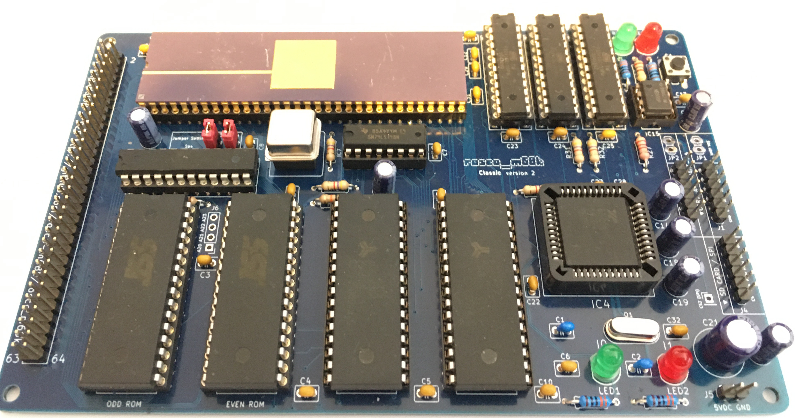
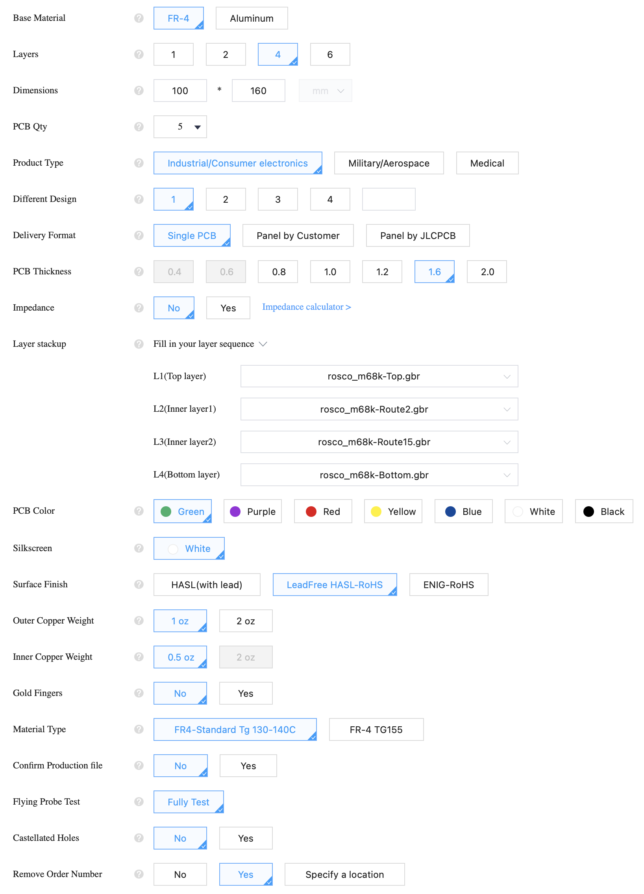

# Really Old-School Computer - M68K
## A Motorola 68k Single-Board Computer

> **Note**: This is the Version 2.42 release branch. If you are using Firmware 2.42 (regardless of base board revision), this is the branch you should be using to build the standard libraries and example programs.

## Boards & Kits Available

> **The best way to support this project is to buy PCBs and kits - visit the <a href='https://store.rosco-m68k.com'>Official Store</a>!**

> Alternatively, you can <a href="https://ko-fi.com/rosco_m68k">buy us a coffee</a> if you like, it would be much appreciated! 😊

## What is this?

This repository holds design files, firmware and software for the Really Old-School Computer 
(M68k) single-board computer, AKA the rosco_m68k. This is a fully-featured, programmable,
extensible and capable 16/32-bit retro computer that is completely open source.

This project contains all the design files and source code for the project. For 
documentation (including assembly instructions) please see https://rosco-m68k.com

You can find the project along with some logs about its development history
on Hackaday: https://hackaday.io/project/164305-yet-another-m68k-homebrew

* All Software released under the MIT licence. See LICENSE for details.
* All Hardware released under the CERN Open Hardware licence.See LICENCE.hardware.txt.
* All Documentation released under Creative Commons Attribution. See https://creativecommons.org/licenses/by/2.0/uk/
* OSHWA-certified Open Source Hardware

## Specifications

### Hardware

The hardware specifications for the rosco_m68k are:

* MC68010P10 at 10MHz.
* XR68C681P provides UART, Timers and SD Card / SPI / GPIO
* 1MB RAM (0x0 - 0xFFFFF)
* 1MB ROM (0xE00000 - 0xEFFFFF)
* 1MB IO space (0xF00000 - 0xFFFFFF)
* High-speed decode and glue logic handled by Atmel F22V10C PLDs.
* Comprehensive expansion and IO connectors allow the system to be easily expanded!

### Software

* A serial bootloader that can load software via the UART (with Kermit protocol)
* Lots of example code and community projects
* Rich firmware interface for with serial and video console for easy programming
* Programmable in assembly, C and (a limited subset of) C++.
* Easy68K-compatible* TRAP 15 (IO) handler
* A growing collection of system libraries and utility code
* Custom Homebrew tap with toolchain - assembly built with VASM; C/C++ built with GCC 10.2.

(*) The firmware is _mostly_ Easy68K compatible - certain functions are not implemented due to the serial nature of IO.

## Getting boards fabricated

If you want to get boards fabricated, we recommend JLCPCB - they did all of our commercial boards
when the rosco_m68k was offered for sale on Tindie. These are the options you'll want when
ordering from them (these should be readily adaptable to other fabs too!)

## Certification

The rosco_m68k is an OSHWA-certified Open Source Hardware project!

https://certification.oshwa.org/uk000006.html

