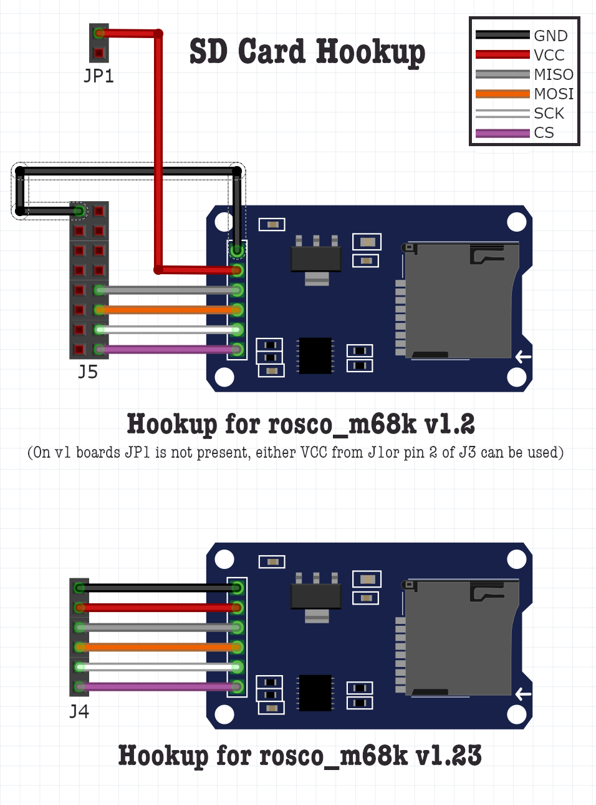

# SD Card Hookup & User Guide

With Firmware 1.3, SD Cards are now supported directly by the firmware. This feature works will all boards that are supported by Firmware 1.3, though the electrical hookup and usage varies.

In order to use SD card, you will need an Arduino SD Card adapter. It is very important that this adapter includes level conversion (as SD cards are 3.3V) - any adapter marked as suitable for Arduino _should_ work, but for completeness ensure it has the regulator and level-conversion chip (as in the diagram below).

## Electrical connection

To connect your SD adapter to your rosco_m68k, you will use some of the GPIO pins (on `J5`) for r1 and r1.2 boards, or the dedicated SD card connector (`J4`) on r1.23 boards. The hookup is as shown below:

The SD adapter should be connected with the rosco_m68k powered off. Ensure all connections are correct before connecting power to the mainboard. Once the adapter is connected, you can insert and remove SD cards without needing to power off or reboot your rosco_m68k.

## Supported SD cards

Most SD cards will work fine in a read-only system, however for best performance and reliability (especially during writes) we recommend good quality SDHC cards with capacity 16 or 32GB. The interface has been fairly extensively tested with SanDisk, Samsung, and similar brands in SDHC capacity.

## SD Card format

In order to work with the standard rosco_m68k software (both the firmware bootloader, where available, and Xark's [sdfat_menu](code/software/sdfat_menu)) your SD card should be formatted as FAT. You can do this on a desktop computer - specifics vary by platform.

FAT32 is recommended (and more completely tested). VFAT is known to be unsupported at this time.

### sdfat_menu

Xark's [sdfat_menu](code/software/sdfat_menu) is the official loader for SD cards, and is the recommended way to interface with your SD card. Whether by direct booting with `BIGROM`s (see below) or by sending the menu program via Kermit before using SD features, the menu provides a comprehensive text interface for selecting binaries to load and run, and also provides a command-shell, directory navigation, and more.

### Bootable SD

If you have the `BIGROM` build of Firmware 1.3, your rosco_m68k will look for an SD card at boot time (before falling back to Kermit). If one is found, it will attempt to load a file called `ROSCODE1.BIN` from the SD card and boot it directly.

It is recommended that, where this capability exists, you use Xark's [sdfat_menu](code/software/sdfat_menu) (see above).

