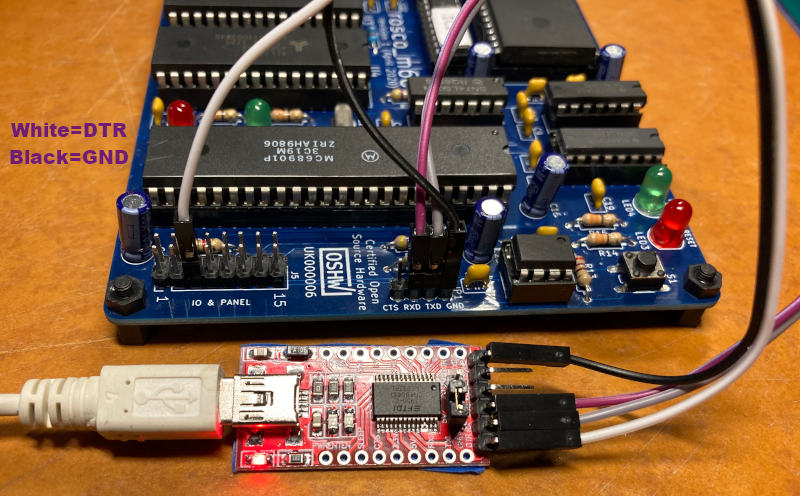

# Rosco_m68k MFP GPIO Interrupt Test Example

This is an example of programming rosco_m68k's MC68901 Multi-Function
Peripheral (MFP) chip's general purpose input/output (GPIO) port to
generate a 680x0 CPU interrupt on a falling edge (high to low transition)
on rosco_m68k's GPIO3 pin (aka JP5-5). When this transition happens, the CPU will
suspend what it is doing and call a special "interrupt handler" function,
which can then do some work and when it returns, the CPU will resume right
where it suspended.

In order to actually see this do anything to interesting, you'll need
something to toggle the signal on J5 pin 5 (GPIO3).  You can use an FTDI
module (including the one you may also be using for rosco_m68k UART), a
switch or an Arduino etc.

However, in my testing, even with _nothing_ hooked up I got a large number
of "bogus" interrupts due to the pin being left floating (especially
when touching JP5 lightly with my finger).

## Building

```
make clean all
```

This will build `mfp-interrupt.bin`, which can be uploaded to a rosco_m68k
board with standard firmware.

This `Makefile` will also make some other potentially useful outputs:

* `gpio-interrupt.elf` the program binary along with additional symbol and debugging information (useful when using other GNU tools vs raw binary)
* `gpio-interrupt.dis` a disassembly of the program (but since it is interspersed with the corresponding source code, it is somewhat more understandable than a raw disassembly)
* `gpio-interrupt.sym` lists symbols used in the program and their address (or value for constants)
* `gpio-interrupt.map` similar to the SYM file this shows where everything for placed in memory by the linker

The test will print to the screen while "counting" high to low transitions
on the J5 pin 5 and toggling the red LED (the green will keep blinking as
usual using the normal rosco 100Hz MFP timer C interrupt).  If there is UART input
the program will issue a "goodbye" message and exit (as if you pressed the reset
 button).

I have tried hard to keep the code all in C and not directly use assembly,
however this task is by nature somewhat low-level and I did find using one line
of assembly was required (at least without removing the `-pedantic` compiler
option, and that didn't quite seem sportsman like).

I have found it handy to use an FTDI adapter to automatically toggle the
GPIO pin (See
[Introduction To FTDI Bitbang Mode](https://hackaday.com/2009/09/22/introduction-to-ftdi-bitbang-mode/)
for a nice example that toggles CTS). You should connect the GND of FTDI to
one of the rosco GND connections (which you should already be doing if using
the FTDI for rosco UART).  Also connect the FTDI signal pin you are using to
JP5-5 (e.g., DTR, CTS or RTS).  I find DTR is handy on the default generic
FTDI modules. **DO NOT** connect power from the FTDI module to rosco (unless you
are using **only** using the FTDI module to power your rosco).

Here is a picture of my FTDI to GPIO3 hook-up.  The red, grey and black wires are normal
UART connections (rosco RXD to FTDI TX, rosco TXD to FTDI RX and GND to GND).  The white
wire is DTR to GPIO3 to generate the interrupt.


I believe, a using switch to toggle JP5-5 between rosco 5V and GND should work
fine also (perhaps with a small-ish ~100 ohm resistor to protect rosco, electrically).

If you're feeling adventurous (and have `ckermit` installed), you
can try:

```
SERIAL=/dev/some-serial-device make load
```

which will attempt to send the binary directly to your board (which
must obviously be connected and waiting for the upload).

